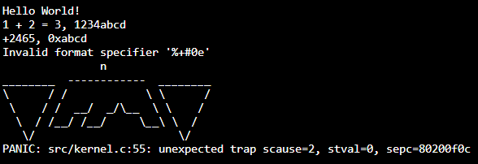

## TetOS
risc-v operating system, should eventually contain [Teto](https://en.wikipedia.org/wiki/Kasane_Teto)



### Quick start
```shell
# replace build with build.exe on windows
# you can also compile with other c compilers (msvc, clang, tinycc)
gcc build.c -o build
./build
#If you already have the ./build executable, you don't need to recompile it manually
```

### Dependencies
 - Any c compiler that produces an executable that your machine can use (riscv-unknown-elf-gcc won't work if you have an amd64 system or windows)
 - riscv-unknown-elf-* tools
 - [viclib](https://github.com/victor-Lopez25/viclib)

### Riscv tools
For Windows, I recommend installing riscv-unknown-elf-* using msys2, but if you find a better way go ahead

